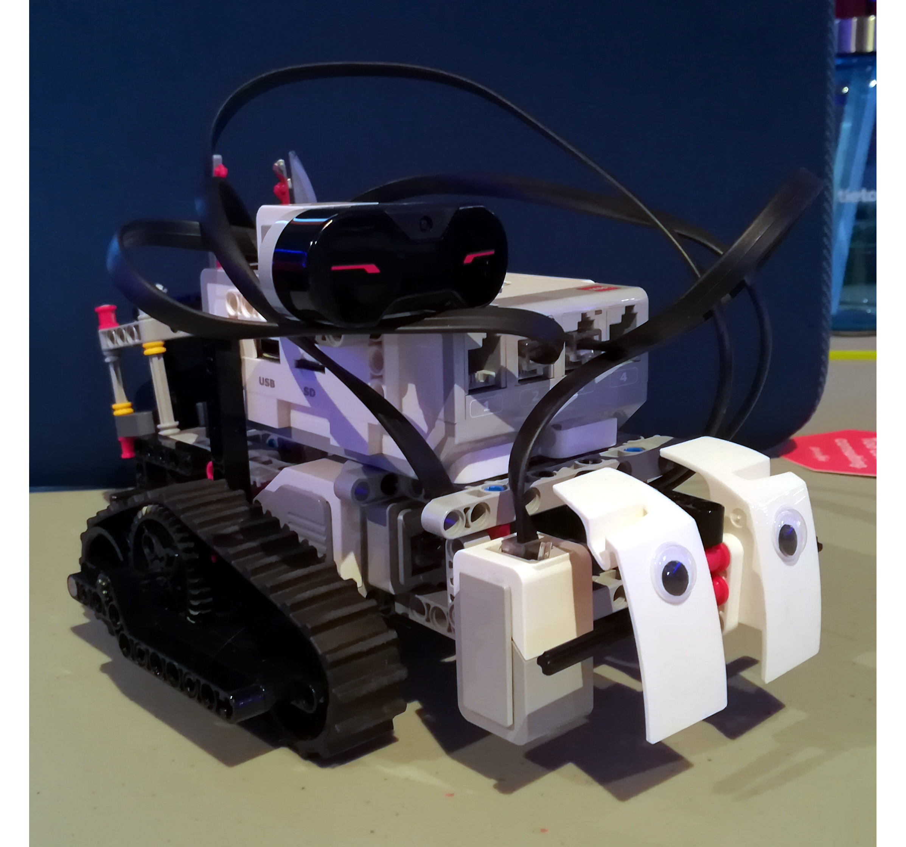
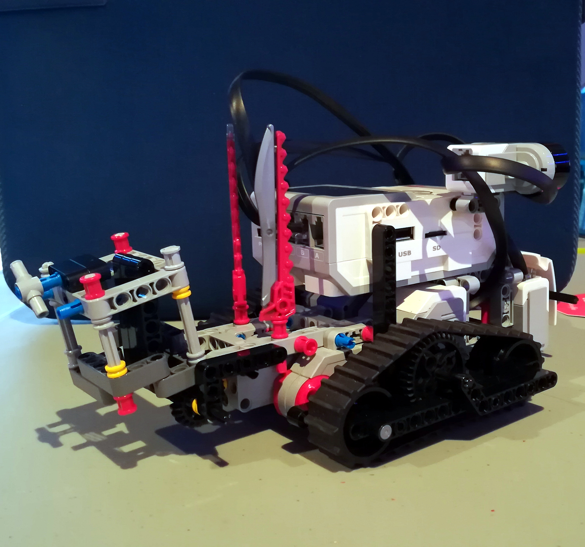

# MonkeyVision
RobotUprising 2019 Hackathon - MonkeyVision team.

Solutions to the challenges presented in Robot Uprising 2019 Hackathon in Helsinki. Four out of five challenges where successfully solved autonomously except number two, that was performed manually. These approaches allowed our team to be ranked fifth out of 38 teams overall.

## Hardware
The robot used in this hackathon is the Lego Mindstorms EV3. Our team in particular programmed it using MicroPython and the framework provided directly onto de brick. Derived from this, our own libraries where written.

The main sensors used are the infrared and the color/light intensity detector.

     

## Challenges layout

    

