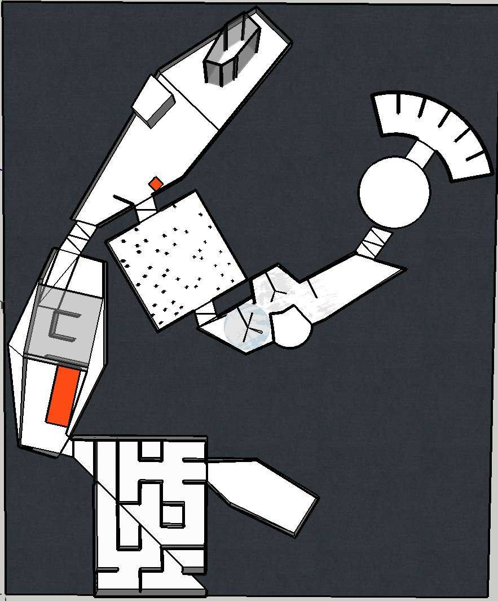

# MonkeyVision
RobotUprising 2019 Hackathon - MonkeyVision team.

Solution to the challenges presented in Robot Uprising 2019 Hackathon in Helsinki. The solutions proposed work for 4/5 challenges (last one is the battle and is controlled manually).

## Challenges layout

## Hardware
The robot used in this hackathon is the Lego Mindstorms EV3. Our team in particular programmed it using MicroPython and the framework provided directly onto de brick. Derived from this, our own libraries where written.
Front of the robot         |  Back of the robot
:-------------------------:|:-------------------------:
 |  

### Main sensors
* Color/light intensity detector.
* Infrared.

